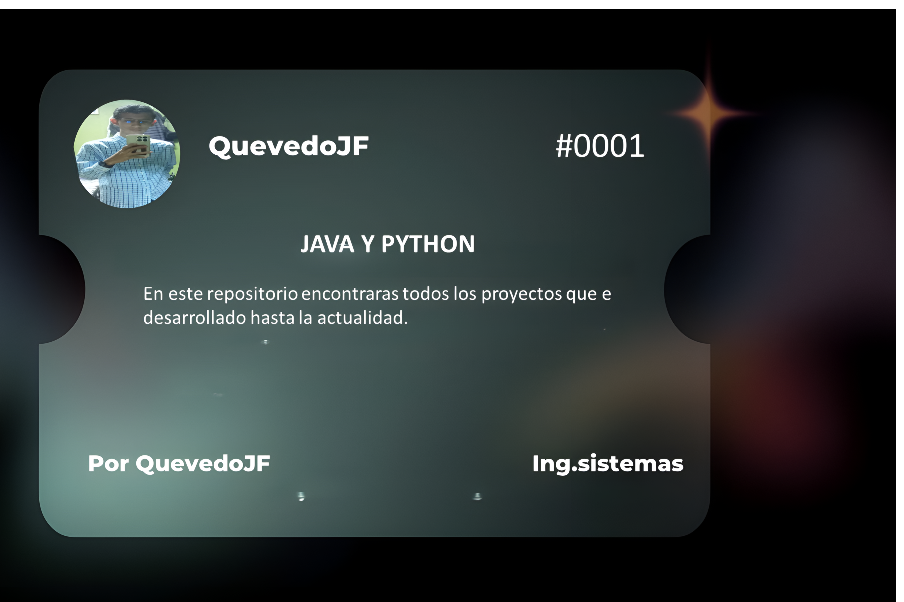
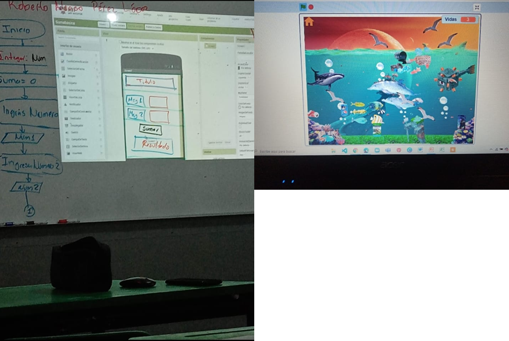

#  Bienvenid@ al Github de Quevedo

## Redes sociales:

Actualmente, estudiante en ingenieria en Sistemas programables,estoy aprendiendo Python con Django a como otros lenguajes de programacion.

## Tecnologias que estoy aprendiendo o domino:

## Las estadisticas del repositorio:

## Mis primeros pasos:
 Primeros pasos de programación👨‍💻🖥️📱

